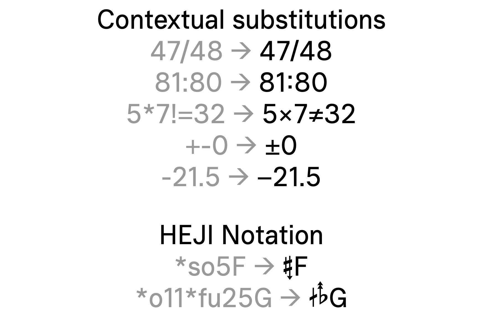

# Plainsound

“Plainsound” is a sans‑serif type family inspired by the quiet discipline of Adrian Frutiger’s “Univers”. Designed for clarity and versatility, “Plainsound” offers six weights, from Extra Light to Bold, each with an italic counterpart. Integrating many OpenType features as well as Helmholtz-Ellis Just Intonation (HEJI) accidentals, “Plainsound” is ideal for use in articles, instruction pages and musical scores focused on microtonal music.

See the full interactive specimen at [https://nicholson.plainsound.org/plainsound](https://nicholson.plainsound.org/plainsound).

## Files

Font files are provided in their respective folders in OTF and WOFF2 format.

## License

All font files are provided under the SIL Open Font License. See LICENSE for more information.
